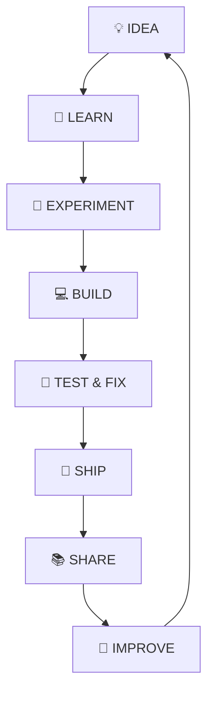

<!--
  Keywords: IM AL IMRAN S, Bangladesh Developer, Web Creator, Android App Developer,
  Telegram Bot Builder, Termux Tool Creator, AI-Assisted Development, Dark Alarm App,
  Imagic Pro, Free Image Editing App, Facebook TikTok Caption Templates
-->

### `$ whoami`

 

---

## 🪪 Profile Summary

| | |
|---|---|
| 👨‍💻 **Name** | IM AL IMRAN S |
| 🇧🇩 **Location** | Bangladesh |
| 🧩 **Role** | Developer & Technology Enthusiast |
| 🛠️ **Focus** | Web • Android • Telegram • Termux • AI-Assisted Development |
| 🟢 **Currently** | Building **Imagic Pro** — a free, template-based image editing app |
| 📫 **Reach me** | [imalimrans.pages.dev/contact](https://imalimrans.pages.dev/contact/) |

---

## ✨ About Me

**Assalamu Alaikum!** I'm **IM AL IMRAN S**, a developer and technology enthusiast from **Bangladesh**.

I believe **every new thing I see is an opportunity to learn**. I explore web development, Android apps, Telegram bots, Termux tools, and modern AI-assisted workflows — turning raw ideas into **simple, useful, and practical projects**.

I'm not a "master" of any single language — my real strength is **using AI as a build partner**: I know enough PHP, Python, Bash, HTML, CSS, JavaScript, SQL, Java, Kotlin, and XML to direct a project, and I lean on AI tools to write, debug, and polish the rest. That's how ideas turn into shipped products, fast.

> 💡 **I don't just want to use technology — I want to understand it, build with it, and share what I learn.**

---

## 🚀 What I Do

 

 

> Badges wrap automatically on small screens, so this section stays readable on mobile.

---

## 🧪 Languages & Tools I Work With

  

  

> I use these languages regularly in real projects, but I lean heavily on AI tools to write, debug, and refine the code — that's my actual workflow, and I'm not shy about it. 😄

---

## 📊 GitHub Dashboard

  

> ✨ Stats & top languages are generated fresh inside this repo every day — no shared third-party server, no rate-limit breakage.

<!--
  NOTE for IM AL IMRAN S (not shown on the public profile):
  github-metrics.svg and github-metrics-calendar.svg come from the workflow in
  metrics-workflow.yml. The achievements plugin was dropped (puppeteer-based,
  kept failing in Actions and blocking the calendar step that ran after it).
  Trophies now use a standalone widget instead — no workflow dependency.
-->

---

## 🏆 GitHub Trophies

> This card is a standalone widget — it does **not** depend on the workflow below, so it works even while the other cards are being set up.

---

## 📈 Contribution Activity

---

## 📱 Imagic Pro — Free Image Editing App

**A completely free, template-based image editing app** — built for creators who want a professional-looking edit in seconds, no design skills required.

**Highlights:**
- 🎨 Huge template library — pick a template, drop in your photo, done
- 📱 **Facebook & TikTok caption templates** — a dedicated collection made especially for caption lovers
- ⚡ Fast, beginner-friendly editing flow — no complex tools to learn
- 🔄 New templates added regularly, sourced from official Imagic Pro content

> Every image posted on Imagic Pro's official TikTok, Facebook, and YouTube is also made available as a ready-to-use template inside the app.

> ⚠️ **Need from you:** the actual website link and download link (Play Store / App Store / APK) so I can swap out the "Coming Soon" badges above — send them and I'll wire them in. The social badges are built from the `@imagicpro` handle you gave me; double-check each link is live before publishing.

---

## 🔥 Other Featured Project

### ⏰ Dark Alarm

A smart Android alarm application designed to help users **wake up on time** with customizable challenges, motivational features, and a clean, distraction-free experience.

**Highlights:**
- 🧩 Customizable wake-up challenges so you can't sleep through the alarm
- 🌙 Clean, distraction-free dark interface
- 💪 Motivational features to build a consistent wake-up routine

---

## 🧩 Project Highlights

<b>🖼️ Imagic Pro</b> — Android App

 
Free, template-based image editing app with dedicated Facebook & TikTok caption templates.

<b>⏰ Dark Alarm</b> — Android App

 
Smart alarm with customizable wake-up challenges, built for a distraction-free morning routine.

<b>🌐 Personal Website</b> — Web

 
IM AL IMRAN S's personal portfolio and project hub, showcasing work across web, Android, and automation.

<b>🤖 Telegram Tools</b> — Telegram

 
Practical Telegram bots and utilities built to automate everyday tasks.

<b>📟 Termux Tools</b> — CLI / Android

 
Lightweight command-line tools designed for mobile development workflows on Termux.

> 🚀 More projects are being built and improved continuously.

---

## 🧠 My Development Philosophy

---

## 🎯 Mission

> **Build digital tools that are fast, accessible, practical, and genuinely useful.**

I want to keep learning, experimenting, building, and sharing knowledge through real projects.

## 🔭 Vision

An open and efficient web where strong fundamentals, practical technology, creativity, and continuous learning come together.

---

## ❓ Frequently Asked Questions

<b>Who is IM AL IMRAN S?</b>

 
A developer and technology enthusiast from Bangladesh who builds practical projects across web, Android, Telegram, and Termux — often using AI as a learning and development tool.

<b>What technologies does he work with?</b>

 
HTML, CSS, JavaScript, PHP, Python, Bash, SQL, Java, Kotlin, and XML — with AI tools doing much of the heavy lifting on the code itself, since his real strength is directing projects, not memorizing syntax.

<b>What is Imagic Pro?</b>

 
A completely free, template-based image editing app. Pick a template — including dedicated Facebook and TikTok caption templates — drop in a photo, and get a polished edit in seconds. No design skills needed.

<b>What is Dark Alarm?</b>

 
A smart Android alarm app with customizable wake-up challenges and a clean, distraction-free interface. Try it at <a href="https://darkalarm.pages.dev/">darkalarm.pages.dev</a>.

<b>How can I contact or collaborate?</b>

 
Reach out via the <a href="https://imalimrans.pages.dev/contact/">contact page</a>, or connect on GitHub, Telegram, Facebook, Instagram, X, YouTube, or TikTok — all linked below.

---

## 🌐 My Website

  

**Profile • Projects • Blog • Contact • More**

---

## 🤝 Let's Connect

 

---

## 💬 A Little Reminder

### **Learn. Build. Share. Improve. 🚀**

*Every project is another step forward.*

---

  

**© 2026 IM AL IMRAN S • Built with curiosity, code & AI**

